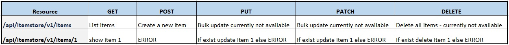
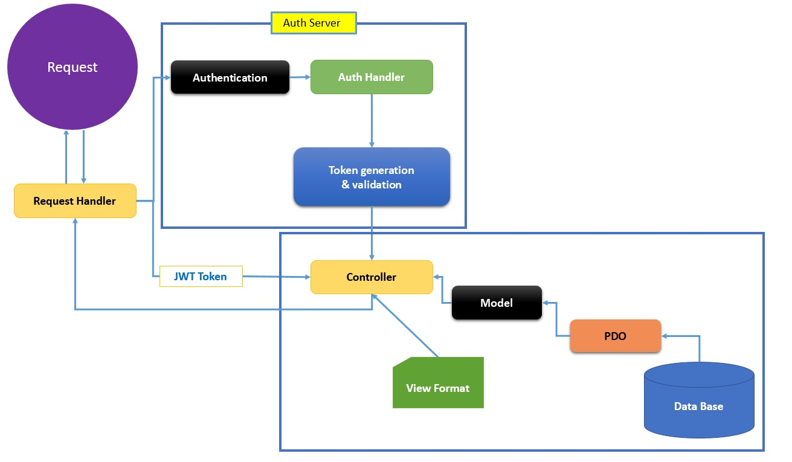
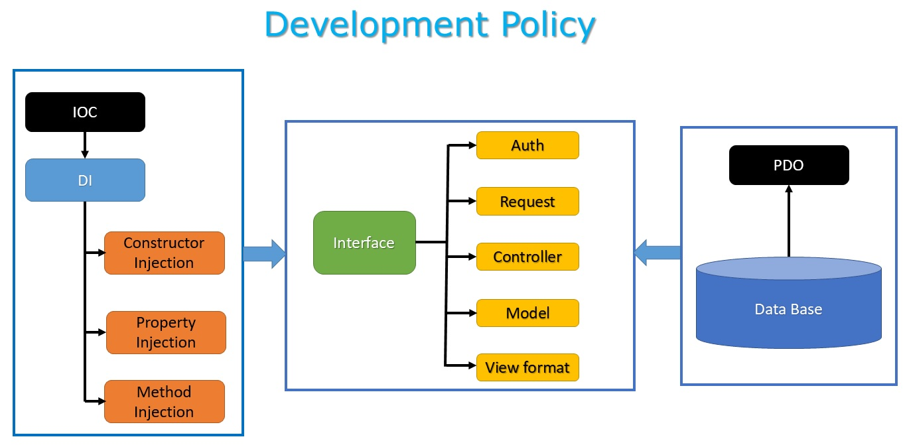

# Create RESTful APIs

1. Create APIs in RESTful service to uses GET, POST, PUT, PATCH & DELETE verbs to perform actions
2. Create Authentication server for JWT token generation and validation

This app is created usign S.O.L.I.D. design pattern with '**Program to Interface**' development methodology. 

The API returns:
* Status 1 for a successful request along with data (if requires)
* Status 0 for an unsuccessful request which is an error.

# Built
App is built on core PHP 8.0.9 and MySQL 8.0.26

# Verbs to perform actions

# Instructions 
* Do not use:
 
 /api/itemstore/v1/getallitems 
 
 /api/itemstore/v1/createitem
 
 /api/itemstore/v1/deleteitem
 
 * A trailing forward slash (/) should not be included in URIs

Exapmle: /api/itemstore/v1/items/       

# V2 [version 2]

Program to interfaces, not implementations

# Object Container Interface

Implemented [PSR-11](https://www.php-fig.org/psr/psr-11/)

# URI structure

**http://[host]:[port]/api/{service name}]/v{version number}/{resource}/{resource ID}**

1. Items URI         : http://127.0.0.1:8080/api/itemstore/v2/items/1    [`requires JWT token on header`]
2. Users URI         : http://127.0.0.1:8080/api/itemstore/v2/users/1    [`requires JWT token on header`]
3. Authentication URI: http://127.0.0.1:8080/api/itemstore/v2/auth/login [`JWT token generation`]

# Features

- [x] Program to interfaces
- [x] Object container - [PSR-11](https://www.php-fig.org/psr/psr-11/)
- [X] CORS Compatible
- [X] S.O.L.I.D. Disign
- [X] Traits
- [X] JWT Authentication
- [x] Microservices Architecture
- [ ] Shorting & Filtering
- [ ] Pagination

# Architecture

# Methodology

